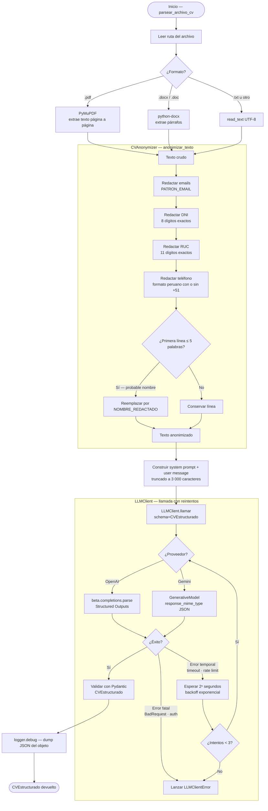
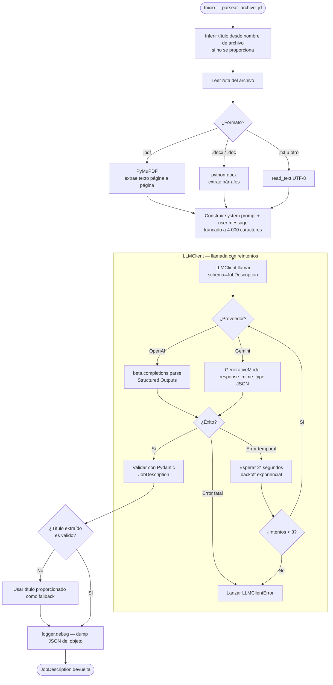
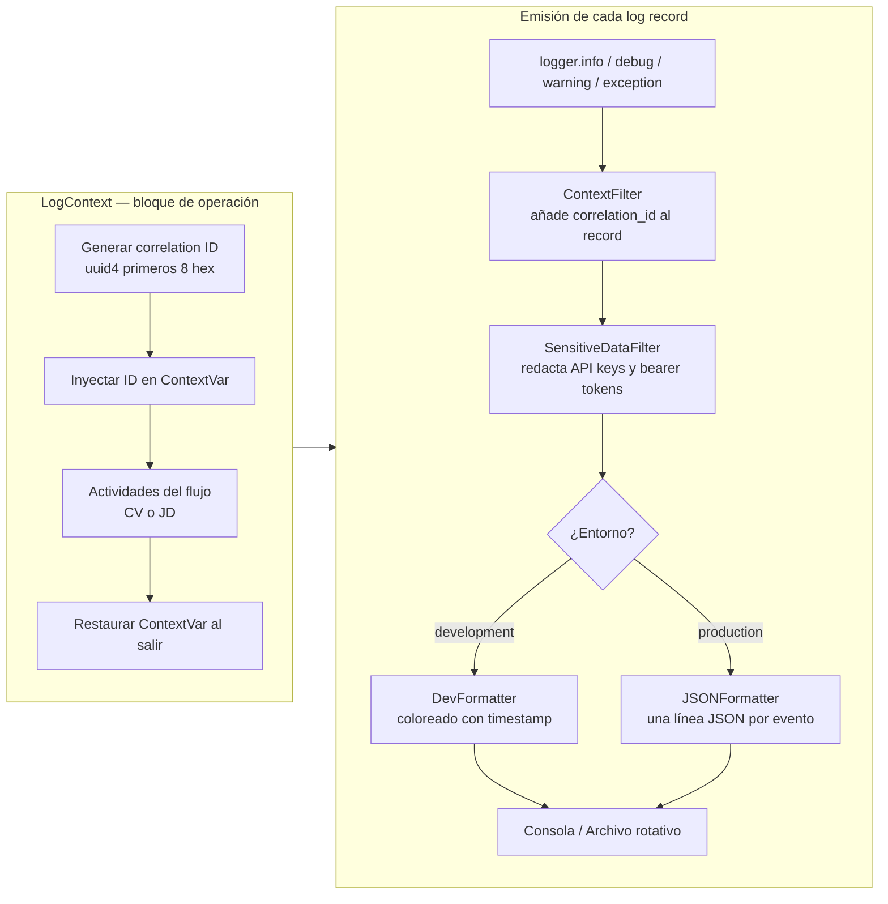

# Diagrama de Actividades — AI CV Matcher

Muestra el flujo de actividades para procesar un CV y una Job Description, desde la lectura del archivo hasta el objeto estructurado de salida.

---

## Flujo de procesamiento de CV

---

## Flujo de procesamiento de Job Description

---

## Logger — actividades transversales

El módulo `logger` actúa de forma transversal en ambos flujos. No interrumpe las actividades sino que las envuelve.

