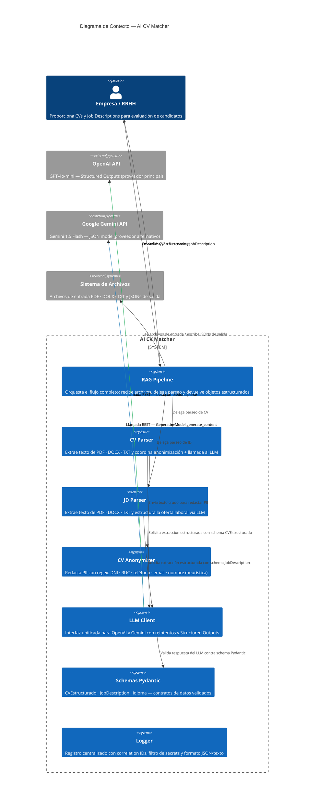

# Diagrama de Contexto — AI CV Matcher

Muestra el sistema, sus actores externos y las dependencias con servicios de terceros.

```mermaid
C4Context
    title Diagrama de Contexto — AI CV Matcher

    Person(rrhh, "Empresa / RRHH", "Proporciona CVs y Job Descriptions para evaluación de candidatos")

    System_Boundary(sistema, "AI CV Matcher") {

        System(pipeline, "RAG Pipeline", "Orquesta el flujo completo: recibe archivos, delega parseo y devuelve objetos estructurados")

        System(cvparser, "CV Parser", "Extrae texto de PDF · DOCX · TXT y coordina anonimización + llamada al LLM")

        System(jdparser, "JD Parser", "Extrae texto de PDF · DOCX · TXT y estructura la oferta laboral via LLM")

        System(anonymizer, "CV Anonymizer", "Redacta PII con regex: DNI · RUC · teléfono · email · nombre (heurística)")

        System(llmclient, "LLM Client", "Interfaz unificada para OpenAI y Gemini con reintentos y Structured Outputs")

        System(schemas, "Schemas Pydantic", "CVEstructurado · JobDescription · Idioma — contratos de datos validados")

        System(logger, "Logger", "Registro centralizado con correlation IDs, filtro de secrets y formato JSON/texto")
    }

    System_Ext(openai, "OpenAI API", "GPT-4o-mini — Structured Outputs (proveedor principal)")
    System_Ext(gemini, "Google Gemini API", "Gemini 1.5 Flash — JSON mode (proveedor alternativo)")
    System_Ext(fs, "Sistema de Archivos", "Archivos de entrada PDF · DOCX · TXT y JSONs de salida")

    Rel(rrhh, pipeline, "Envía CVs y Job Descriptions")
    Rel(pipeline, cvparser, "Delega parseo de CV")
    Rel(pipeline, jdparser, "Delega parseo de JD")
    Rel(pipeline, fs, "Lee archivos de entrada / escribe JSONs de salida")
    Rel(cvparser, anonymizer, "Envía texto crudo para redactar PII")
    Rel(cvparser, llmclient, "Solicita extracción estructurada con schema CVEstructurado")
    Rel(jdparser, llmclient, "Solicita extracción estructurada con schema JobDescription")
    Rel(llmclient, schemas, "Valida respuesta del LLM contra schema Pydantic")
    Rel(llmclient, openai, "Llamada REST — beta.completions.parse")
    Rel(llmclient, gemini, "Llamada REST — GenerativeModel.generate_content")
    Rel(pipeline, rrhh, "Devuelve CVEstructurado y JobDescription")

    UpdateRelStyle(rrhh, pipeline, $textColor="black", $lineColor="#555")
    UpdateRelStyle(pipeline, rrhh, $textColor="black", $lineColor="#555")
    UpdateRelStyle(llmclient, openai, $textColor="black", $lineColor="#27ae60")
    UpdateRelStyle(llmclient, gemini, $textColor="black", $lineColor="#2980b9")
```
